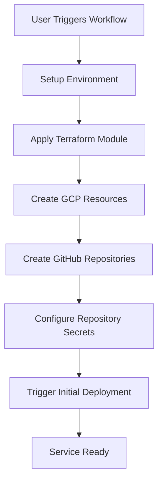
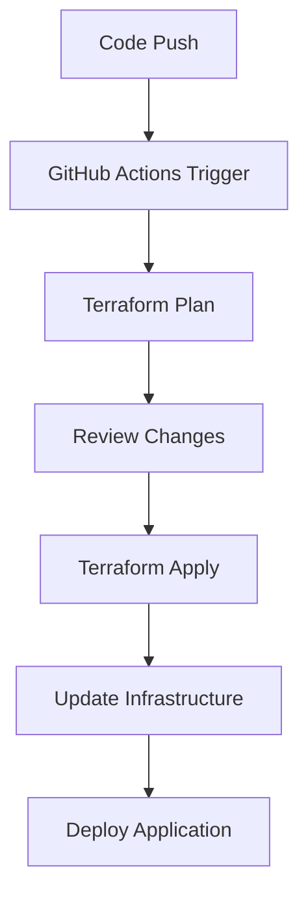

# Architecture Overview

This document provides an overview of the Terraform microservice modules architecture and how the system works.

## System Architecture

```
┌─────────────────────────────────────────────────────────────────┐
│                    GitHub Repository                           │
│  ┌─────────────────┐  ┌─────────────────┐  ┌─────────────────┐ │
│  │   Main Module   │  │  API Service    │  │  Web Service    │ │
│  │   Repository    │  │    Module       │  │    Module       │ │
│  └─────────────────┘  └─────────────────┘  └─────────────────┘ │
└─────────────────────────────────────────────────────────────────┘
                                │
                                ▼
┌─────────────────────────────────────────────────────────────────┐
│                    GitHub Actions                              │
│  ┌─────────────────┐  ┌─────────────────┐  ┌─────────────────┐ │
│  │ Create Service  │  │  Apply Terraform│  │  Deploy Service │ │
│  │   Workflow      │  │   Workflow      │  │   Workflow      │ │
│  └─────────────────┘  └─────────────────┘  └─────────────────┘ │
└─────────────────────────────────────────────────────────────────┘
                                │
                                ▼
┌─────────────────────────────────────────────────────────────────┐
│                    Google Cloud Platform                       │
│  ┌─────────────────┐  ┌─────────────────┐  ┌─────────────────┐ │
│  │   Compute       │  │   Networking    │  │   Storage       │ │
│  │   Engine        │  │   & Security    │  │   & Logging     │ │
│  └─────────────────┘  └─────────────────┘  └─────────────────┘ │
└─────────────────────────────────────────────────────────────────┘
                                │
                                ▼
┌─────────────────────────────────────────────────────────────────┐
│                    Created Repositories                        │
│  ┌─────────────────┐  ┌─────────────────┐  ┌─────────────────┐ │
│  │  Service Repo   │  │ Infrastructure  │  │  Template       │ │
│  │  (Application)  │  │     Repo        │  │  Repositories   │ │
│  └─────────────────┘  └─────────────────┘  └─────────────────┘ │
└─────────────────────────────────────────────────────────────────┘
```

## Component Overview

### 1. Terraform Modules

The repository contains three main Terraform modules:

#### API Service Module (`modules/api-service/`)
- **Purpose**: REST API services with load balancing
- **Resources**: VPC, subnet, instance groups, load balancer, health checks
- **Features**: Auto-scaling, health monitoring, SSL termination

#### Web Service Module (`modules/web-service/`)
- **Purpose**: Web applications with CDN and SSL
- **Resources**: VPC, subnet, CDN, SSL certificates, storage buckets
- **Features**: Global CDN, managed SSL, static asset hosting

#### Worker Service Module (`modules/worker-service/`)
- **Purpose**: Background processing with message queues
- **Resources**: VPC, subnet, Pub/Sub topics, Cloud Functions, storage
- **Features**: Message queuing, auto-scaling workers, data processing

### 2. GitHub Actions Workflows

#### Create Microservice Workflow (`workflows/create-microservice.yml`)
- **Trigger**: Manual workflow dispatch
- **Purpose**: Creates new microservice instances
- **Actions**:
  - Sets up Terraform environment
  - Applies infrastructure configuration
  - Creates GitHub repositories
  - Configures secrets and permissions
  - Triggers initial deployment

#### Terraform Apply Workflow (`workflows/terraform-apply.yml`)
- **Trigger**: Push to main branch
- **Purpose**: Manages infrastructure changes
- **Actions**:
  - Plans Terraform changes
  - Applies approved changes
  - Manages state in GCS

### 3. Template Repositories

#### Infrastructure Template (`templates/infrastructure-template/`)
- **Purpose**: Base template for infrastructure repositories
- **Contents**:
  - Terraform configurations for GCP resources
  - Monitoring and logging setup
  - Security configurations
  - CI/CD workflows

#### Service Template (`templates/service-template/`)
- **Purpose**: Base template for application repositories
- **Contents**:
  - Flask application skeleton
  - Docker configuration
  - Testing framework
  - Deployment workflows

## Workflow Process

### 1. Service Creation Process



### 2. Infrastructure Management



## Resource Hierarchy

### GCP Resources Created

1. **Networking Layer**
   - VPC Network
   - Subnets
   - Firewall Rules
   - Load Balancers

2. **Compute Layer**
   - Instance Templates
   - Instance Groups
   - Auto-scaling Policies
   - Health Checks

3. **Storage Layer**
   - Cloud Storage Buckets
   - Logging Sinks
   - Backup Policies

4. **Security Layer**
   - Service Accounts
   - IAM Roles
   - SSL Certificates
   - Network Policies

5. **Monitoring Layer**
   - Cloud Monitoring Dashboards
   - Alerting Policies
   - Log Aggregation

### GitHub Resources Created

1. **Service Repository**
   - Application code
   - Docker configuration
   - CI/CD pipelines
   - Testing framework

2. **Infrastructure Repository**
   - Terraform configurations
   - Environment-specific settings
   - Monitoring dashboards
   - Security policies

## Security Considerations

### 1. Authentication & Authorization
- Service accounts with minimal required permissions
- GitHub tokens with specific scopes
- IAM roles following least privilege principle

### 2. Network Security
- Private subnets for compute instances
- Firewall rules restricting access
- SSL/TLS encryption for all traffic

### 3. Data Protection
- Encrypted storage buckets
- Secure secret management
- Audit logging enabled

## Scalability Features

### 1. Auto-scaling
- Instance groups with automatic scaling
- Load balancer health checks
- Cloud Functions for serverless processing

### 2. Global Distribution
- CDN for static content
- Multi-region load balancing
- Global storage buckets

### 3. Monitoring & Alerting
- Real-time metrics collection
- Automated alerting
- Performance dashboards

## Cost Optimization

### 1. Resource Management
- Automatic scaling based on demand
- Preemptible instances for non-critical workloads
- Storage lifecycle policies

### 2. Monitoring
- Cost tracking and alerts
- Resource utilization monitoring
- Automated cleanup of unused resources

## Best Practices

### 1. Infrastructure as Code
- All resources defined in Terraform
- Version-controlled configurations
- Automated testing and validation

### 2. CI/CD Pipeline
- Automated testing and deployment
- Environment promotion
- Rollback capabilities

### 3. Monitoring & Observability
- Comprehensive logging
- Performance metrics
- Error tracking and alerting

## Future Enhancements

### 1. Multi-cloud Support
- AWS and Azure modules
- Cloud-agnostic configurations
- Hybrid cloud deployments

### 2. Advanced Features
- Service mesh integration
- Advanced monitoring and tracing
- Automated performance optimization

### 3. Developer Experience
- Web-based service creation
- Visual infrastructure diagrams
- Integrated development environments 